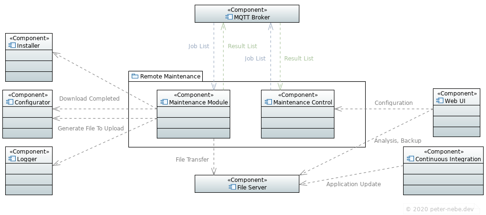

# remote-maintenance
Example of remote maintenance of connected devices

### Dependencies
- [paho.mqtt.cpp 1.1](https://github.com/eclipse/paho.mqtt.cpp)
- [boost 1.74.0](https://www.boost.org)

### Features
- Secure data exchange with mutual authentication and encryption*
- Network protocol MQTT with TLS, file transfer with SSH*
- Design with easily interchangeable network and data protocols
- The data protocol is currently a simple serialization / deserialization
- The maintenance jobs are essentially file transfer jobs, other jobs can easily be incorporated
- Maintenance jobs can be identical for many devices or specific to individual devices
- The devices do not have to be constantly connected to the Internet*
- The devices do not need to offer any service over an open port*
- Request for log files with filter

*Security feature

### Detailed description
There are a few typical maintenance tasks for devices in operation:
- Analysis of log files
- Analysis of status and error reports
- Backup of the current configuration
- Reconfiguration of device
- Update of application
- Update of operating system
- Cleaning up directories

Some of these operations are sometimes intended to be performed identically on many devices. When solving the task, security requirements and operational processes must be observed. Many devices have an Internet connection, but are not constantly connected to the Internet. That can be a security measure.

**remote-maintenance** takes care of the file transfer. This is how it works:
- The maintenance control publishes a list of maintenance jobs for one or more devices
- Every device goes into maintenance mode at some point (manually or regularly automatically)
- A device in maintenance mode periodically queries the maintenance jobs
- After the jobs have been carried out, the device sends a list of results back to the control
- The maintenance module delegates tasks to other modules that are intended for the respective purpose: the processing of received files and the generation of files to be sent

### UML Diagram

